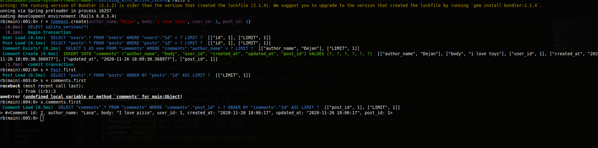

# Building With Active Records

> This project is about active records,models, and associations to the tests. This application similar to Reddit (called Micro-Reddit) where a user can create a post and add comments to it.For each scenario, we are asked to write down the data, associations, and validations necessary to build it. That means which models (data tables) will be necessary to store the data (and which columns you will need), which fields of those tables will be subject to validation (e.g. minimum password length or username uniqueness).

Additional description about the project and its features.

## Built With

- Ruby
- Rails

### Install

Ruby and install Rails on your local machine

### Setup

Open your terminal and go to the directory where you want to clone the repo.

Clone the repository to your local machine. Type $ git clone `git@github.com:https://github.com/cvilla714/building_with_active_record.git`

Go to the building_with_active_records directory. Type $ cd building_with_active_records

Install the necessary gems to run the project. Type $ bundle install

Also please run this command `rails db:migrate` to run all the migration for the database and have all tables updated and read to use

Now your environment is ready to run the project. Type rails c

## Authors

👤 **Andjela Vukadinovic**

- GitHub: [@410AngelaVu](https://github.com/410AngelaVu)
- Twitter: [@andjelavukadin7](https://twitter.com/andjelavukadin7)
- LinkedIn: [LinkedIn](https://www.linkedin.com/in/andjela-vukadinovic-67a21b1b2/)

👤 **Devkc**

- GitHub: [@cvilla714](https://github.com/cvilla714)
- Twitter: [@kckeyti](https://twitter.com/kckeyti)
- LinkedIn: [LinkedIn](https://www.linkedin.com/in/cosmel-villalobos-1900531aa/)

## 🤝 Contributing

Contributions, issues, and feature requests are welcome!

Feel free to check the [issues page](issues/).

## Show your support

Give a ⭐️ if you like this project!
